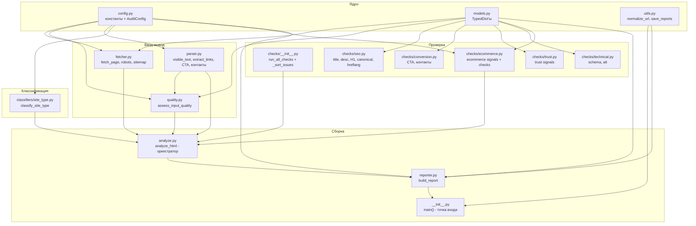

# Анализ плана модульной архитектуры

## Текущее состояние

Файл [`audit.py`](audit.py) — монолит **~2214 строк**, версия **0.5**.

План [`plans/modular-architecture.md`](plans/modular-architecture.md) предлагает разбиение на пакет `audit/` с 16 модулями.

## Ключевые решения (согласованы)

### Решение 1: Модели данных — TypedDict (вместо dataclass)
Используем `TypedDict` из `typing` для типизации dict'ов без изменения логики их создания. Это даёт:
- Автодополнение в IDE
- Проверку типов mypy/pyright
- Минимальные изменения кода (только аннотации возврата)
- Полную обратную совместимость

### Решение 2: `run_quality_checks` → `run_all_checks` в `checks/__init__.py`
Объединяем `run_quality_checks` (строка 1333) и вызов ecommerce-проверок в единую `run_all_checks`, как описано в плане.

### Решение 3: Константы отчёта в `config.py`
`_ECOMMERCE_CHECKLIST_GROUPS` и `SITE_TYPE_LABELS` остаются в `config.py`, импортируются в `reporter.py`.

## Что уже реализовано в v0.5 (учтено в плане)

- ✅ robots.txt + sitemap.xml
- ✅ canonical, hreflang, schema.org, alt-атрибуты
- ✅ X-Robots-Tag из HTTP-заголовков
- ✅ Классификация сайта (4 типа + unknown)
- ✅ Ecommerce-сигналы и проверки (16 пунктов)
- ✅ Отчёт в Markdown

## Диаграмма зависимостей



## Порядок реализации

### Шаг 1: Создать структуру директорий
```
audit/
├── __init__.py
├── config.py
├── models.py
├── utils.py
├── fetcher.py
├── quality.py
├── parser.py
├── analyze.py
├── reporter.py
├── checks/
│   ├── __init__.py
│   ├── seo.py
│   ├── conversion.py
│   ├── trust.py
│   ├── technical.py
│   └── ecommerce.py
└── classifiers/
    ├── __init__.py
    └── site_type.py
```

### Шаг 2: Модули без зависимостей
1. [`audit/config.py`](audit/config.py) — все константы + dataclass `AuditConfig`
2. [`audit/models.py`](audit/models.py) — TypedDict'ы: `FetchResult`, `Issue`, `EcommerceIssue`, `QualityResult`, `AnalysisResult`
3. [`audit/utils.py`](audit/utils.py) — `normalize_url`, `domain_dir_name`, `save_reports`, `truncate_evidence`, `significant_words`, `word_repeat_spam`

### Шаг 3: Модули с одной зависимостью
4. [`audit/fetcher.py`](audit/fetcher.py) — `fetch_page`, `check_robots_txt`, `check_sitemap`
5. [`audit/parser.py`](audit/parser.py) — `visible_text`, `extract_links`, `collect_ctas`, `collect_contacts`, `collect_trust_depth`, `classify_cta_label`, `is_likely_cta_element`
6. [`audit/quality.py`](audit/quality.py) — `assess_input_quality`, `_detect_antibot`, `_detect_js_shell`, `looks_like_mojibake`, `_add_reason`

### Шаг 4: Проверки
7. [`audit/checks/seo.py`](audit/checks/seo.py) — `check_title_quality`, `check_description_quality`, `check_h1_offer_quality`, `check_canonical`, `check_hreflang`
8. [`audit/checks/conversion.py`](audit/checks/conversion.py) — `check_cta_quality`, `check_contacts`
9. [`audit/checks/trust.py`](audit/checks/trust.py) — `check_trust_depth`, `_trust_evidence`
10. [`audit/checks/technical.py`](audit/checks/technical.py) — `check_schema_org`, `check_alt_attributes`
11. [`audit/checks/ecommerce.py`](audit/checks/ecommerce.py) — `_ecommerce_search_blob`, `collect_ecommerce_signals`, `run_ecommerce_checks`
12. [`audit/checks/__init__.py`](audit/checks/__init__.py) — `run_all_checks` + `_sort_issues`

### Шаг 5: Классификаторы
13. [`audit/classifiers/site_type.py`](audit/classifiers/site_type.py) — `classify_site_type`, `_classify_score_type`, `_classify_extra_hits`

### Шаг 6: Сборка
14. [`audit/analyze.py`](audit/analyze.py) — `analyze_html` (оркестратор)
15. [`audit/reporter.py`](audit/reporter.py) — `build_report`, `build_insufficient_data_report`
16. [`audit/__init__.py`](audit/__init__.py) — `main()`, `VERSION`, `if __name__ == "__main__"`

### Шаг 7: Финальная проверка
17. Переименовать `audit.py` в `audit_legacy.py` (для reference)
18. Запустить `python -m audit https://example.com`
19. Сравнить отчёты до/после рефакторинга на 3-4 сайтах

## Риски

| Риск | Вероятность | Митигация |
|------|-------------|-----------|
| Изменение поведения при переносе | Средняя | Сравнить отчёты до/после на 3-4 сайтах |
| Забыть перенести константу | Средняя | Проверить все импорты в `config.py` |
| Ошибка в импортах | Низкая | `python -m audit` покажет сразу |
| Конфликт имён с существующим `audit.py` | Низкая | `audit.py` → `audit_legacy.py` |
