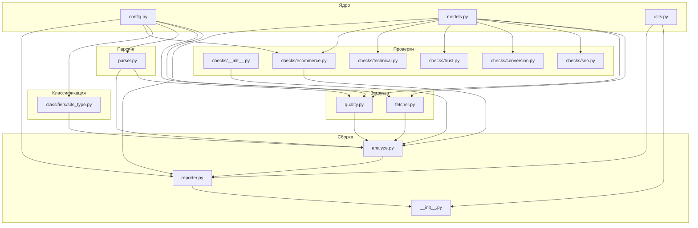

# План модульной архитектуры: разбиение audit.py на пакет

## 1. Текущее состояние

Файл [`audit.py`](../audit.py) — монолит **~2214 строк**, содержащий:

| Компонент | Строки | Описание |
|-----------|--------|----------|
| Импорты + константы | 1–232 | Зависимости, USER_AGENT, TIMEOUT, списки классификации, CTA, VAGUE_H1, regex |
| Утилиты | 234–307 | `normalize_url`, `domain_dir_name`, `save_reports`, `truncate_evidence`, `make_issue`, `make_ecommerce_issue` |
| Fetcher | 310–342 | `fetch_page` — HTTP-запрос через `requests` |
| Robots + Sitemap | 345–423 | `check_robots_txt`, `check_sitemap` |
| Антибот + качество | 427–565 | Маркеры антибота, JS-shell, `assess_input_quality`, `looks_like_mojibake` |
| Парсинг HTML | 568–710 | `visible_text`, `extract_links`, `collect_ctas`, `collect_contacts`, `collect_trust_depth` |
| SEO-проверки | 743–978 | `check_description_quality`, `check_title_quality`, `check_h1_offer_quality` |
| Conversion + Trust | 981–1151 | `check_cta_quality`, `check_contacts`, `check_trust_depth` |
| Технические проверки | 1153–1331 | `check_canonical`, `check_hreflang`, `check_schema_org`, `check_alt_attributes` |
| Ecommerce | 1355–1616 | `_ecommerce_search_blob`, `collect_ecommerce_signals`, `run_ecommerce_checks` |
| Классификация | 1625–1755 | `_classify_score_type`, `_classify_extra_hits`, `classify_site_type` |
| Оркестратор | 1758–1829 | `analyze_html` — собирает всё вместе |
| Reporter | 1832–2176 | `build_report`, `build_insufficient_data_report` |
| CLI (main) | 2179–2214 | `main()` — точка входа |

## 2. Целевая структура пакета

```
audit/
├── __init__.py              # Точка входа, CLI (main), версия
├── config.py                # Dataclass с конфигурацией, константы
├── models.py                # Pydantic / dataclass модели (Issue, FetchResult, AnalysisResult)
├── fetcher.py               # HTTP-запросы, robots.txt, sitemap.xml
├── parser.py                # BeautifulSoup-парсинг (title, description, H1, ссылки, CTA, контакты, trust)
├── quality.py               # Оценка пригодности ответа (антибот, JS-shell, mojibake)
├── checks/
│   ├── __init__.py          # Регистр проверок, run_all_checks
│   ├── seo.py               # Title, description, H1, canonical, hreflang
│   ├── conversion.py        # CTA, контакты
│   ├── trust.py             # Trust signals
│   ├── technical.py         # HTTP-заголовки, favicon, alt-атрибуты, schema.org
│   └── ecommerce.py         # Ecommerce-сигналы и проверки
├── classifiers/
│   ├── __init__.py
│   └── site_type.py         # Классификация типа сайта
├── reporter.py              # Генерация Markdown-отчёта
└── utils.py                 # Общие утилиты (normalize_url, domain_dir_name, truncate_evidence)
```

## 3. Детальное описание каждого модуля

### 3.1 [`audit/__init__.py`](audit/__init__.py)

**Назначение:** Точка входа, CLI, версия.

```python
VERSION = "0.6"

def main() -> int:
    parser = argparse.ArgumentParser(...)
    parser.add_argument("url", ...)
    # TODO: --format, --output, --config
    args = parser.parse_args()
    
    url = normalize_url(args.url)
    fetch = fetch_page(url)
    quality = assess_input_quality(fetch)
    robots = check_robots_txt(url)
    sitemap = check_sitemap(url, robots)
    
    analysis = None
    if fetch.ok and quality.suitable:
        analysis = analyze_html(fetch.html, fetch.final_url)
    
    report = build_report(url, fetch, analysis, quality, robots, sitemap)
    save_reports(url, report)
```

**Переносим из audit.py:**
- `VERSION` (строка 22)
- `main()` (строки 2179–2214)
- `if __name__ == "__main__"` (строки 2212–2213)

### 3.2 [`audit/config.py`](audit/config.py)

**Назначение:** Все константы и настройки в одном месте.

```python
from dataclasses import dataclass, field

@dataclass
class AuditConfig:
    user_agent: str = "Mozilla/5.0 (compatible; SiteAuditBot/0.6; ...)"
    timeout: int = 15
    min_html_chars: int = 200
    min_visible_text_chars: int = 250
    classify_min_primary_score: int = 25
    classify_min_hits: int = 2
    classify_secondary_min_score: int = 25
    classify_secondary_gap_max: int = 25
    max_internal_links: int = 20
    reports_dir: str = "reports"
```

**Переносим из audit.py:**
- `USER_AGENT` (строка 16–18)
- `TIMEOUT` (строка 19)
- `REPORTS_DIR` (строка 21)
- `_MIN_HTML_CHARS` (строка 63)
- `_MIN_VISIBLE_TEXT_CHARS` (строка 64)
- `_CLASSIFY_MIN_PRIMARY_SCORE` (строка 146)
- `_CLASSIFY_MIN_HITS` (строка 147)
- `_CLASSIFY_SECONDARY_MIN_SCORE` (строка 148)
- `_CLASSIFY_SECONDARY_GAP_MAX` (строка 149)
- `SITE_TYPE_LABELS` (строка 66–72)
- `_ECOMMERCE_CHECKLIST_GROUPS` (строки 25–60)
- Все списки: `CTA_STRONG`, `CTA_WEAK`, `VAGUE_H1` (строки 151–219)
- Все маркеры: `_ANTIBOT_STRONG_MARKERS`, `_ANTIBOT_WEAK_MARKERS`, `_JS_SHELL_MARKERS` (строки 427–457)
- Все классификационные кортежи: `_CLASSIFY_ECOMMERCE`, `_CLASSIFY_SERVICES`, `_CLASSIFY_CORPORATE`, `_CLASSIFY_SAAS` (строки 75–144)

### 3.3 [`audit/models.py`](audit/models.py)

**Назначение:** Типизированные модели данных вместо сырых `dict`.

```python
from dataclasses import dataclass, field
from typing import Optional

@dataclass
class FetchResult:
    ok: bool
    status_code: Optional[int]
    final_url: str
    elapsed_ms: int
    html: str
    headers: dict
    error: Optional[str]

@dataclass
class Issue:
    severity: str  # "high" | "medium" | "low"
    issue: str
    recommendation: str
    evidence: Optional[str] = None
    category: Optional[str] = None  # "seo" | "offer" | "conversion" | "trust" | "ecommerce"

@dataclass
class EcommerceIssue(Issue):
    why: str = ""
    effect: str = ""

@dataclass
class QualityResult:
    suitable: bool
    reasons: list[str] = field(default_factory=list)
    details: list[str] = field(default_factory=list)

@dataclass
class AnalysisResult:
    title: str
    description: str
    h1: list[str]
    h2: list[str]
    internal_links: list[str]
    cta: dict
    contacts: dict
    trust: dict
    site_type: dict
    issues: list[Issue]
    ecommerce_checklist: Optional[dict] = None
    ecommerce_issues: list[Issue] = field(default_factory=list)
    canonical: Optional[dict] = None
    schema: Optional[dict] = None
    alt: Optional[dict] = None
    hreflang: Optional[dict] = None
```

**Переносим из audit.py:**
- `make_issue` (строки 273–290) → конструктор `Issue`
- `make_ecommerce_issue` (строки 293–307) → конструктор `EcommerceIssue`

### 3.4 [`audit/utils.py`](audit/utils.py)

**Назначение:** Общие утилиты без зависимостей от других модулей.

```python
import re
from pathlib import Path
from urllib.parse import urlparse
from datetime import datetime

def normalize_url(raw: str) -> str: ...
def domain_dir_name(url: str) -> str: ...
def save_reports(url: str, content: str) -> tuple[Path, Path]: ...
def truncate_evidence(text: str, max_len: int = 120) -> str: ...
def significant_words(text: str, min_len: int = 5) -> set[str]: ...
def word_repeat_spam(text: str) -> str | None: ...
```

**Переносим из audit.py:**
- `normalize_url` (строки 234–243)
- `domain_dir_name` (строки 246–248)
- `save_reports` (строки 251–263)
- `truncate_evidence` (строки 266–270)
- `significant_words` (строки 598–600)
- `word_repeat_spam` (строки 603–611)

### 3.5 [`audit/fetcher.py`](audit/fetcher.py)

**Назначение:** HTTP-запросы, robots.txt, sitemap.xml.

```python
import requests
from audit.config import AuditConfig
from audit.models import FetchResult

def fetch_page(url: str, config: AuditConfig | None = None) -> FetchResult: ...
def check_robots_txt(base_url: str, config: AuditConfig | None = None) -> dict: ...
def check_sitemap(base_url: str, robots: dict, config: AuditConfig | None = None) -> dict: ...
```

**Переносим из audit.py:**
- `fetch_page` (строки 310–342)
- `check_robots_txt` (строки 345–382)
- `check_sitemap` (строки 385–423)

### 3.6 [`audit/quality.py`](audit/quality.py)

**Назначение:** Оценка пригодности ответа для аудита.

```python
from bs4 import BeautifulSoup
from audit.config import AuditConfig
from audit.models import FetchResult, QualityResult

def assess_input_quality(fetch: FetchResult, config: AuditConfig | None = None) -> QualityResult: ...
def _detect_antibot(html_lower: str, *, status: int | None, visible_len: int) -> bool: ...
def _detect_js_shell(soup: BeautifulSoup, html_lower: str, visible_len: int) -> bool: ...
def looks_like_mojibake(text: str) -> bool: ...
```

**Переносим из audit.py:**
- `assess_input_quality` (строки 507–565)
- `_detect_antibot` (строки 473–481)
- `_detect_js_shell` (строки 484–499)
- `looks_like_mojibake` (строки 462–470)
- `_add_reason` (строки 502–504)

### 3.7 [`audit/parser.py`](audit/parser.py)

**Назначение:** Извлечение данных из HTML через BeautifulSoup.

```python
from bs4 import BeautifulSoup

def visible_text(soup: BeautifulSoup) -> str: ...
def extract_links(soup: BeautifulSoup, base_url: str, max_links: int = 20) -> list[str]: ...
def collect_ctas(soup: BeautifulSoup) -> dict: ...
def collect_contacts(soup: BeautifulSoup, text_lower: str) -> dict: ...
def collect_trust_depth(soup: BeautifulSoup, text_lower: str) -> dict: ...
def classify_cta_label(label: str) -> str: ...
def is_likely_cta_element(el) -> bool: ...
```

**Переносим из audit.py:**
- `visible_text` (строки 568–572)
- `extract_links` (строки 575–595)
- `collect_ctas` (строки 641–677)
- `collect_contacts` (строки 680–710)
- `collect_trust_depth` (строки 713–740)
- `classify_cta_label` (строки 614–620)
- `is_likely_cta_element` (строки 623–638)

### 3.8 [`audit/checks/__init__.py`](audit/checks/__init__.py)

**Назначение:** Регистр всех проверок, функция `run_all_checks`.

```python
from audit.models import Issue
from audit.checks.seo import run_seo_checks
from audit.checks.conversion import run_conversion_checks
from audit.checks.trust import run_trust_checks
from audit.checks.technical import run_technical_checks
from audit.checks.ecommerce import run_ecommerce_checks

def run_all_checks(analysis: dict) -> list[Issue]:
    issues: list[Issue] = []
    issues.extend(run_seo_checks(analysis))
    issues.extend(run_conversion_checks(analysis))
    issues.extend(run_trust_checks(analysis))
    issues.extend(run_technical_checks(analysis))
    if analysis.get("site_type", {}).get("primary_type") == "ecommerce":
        issues.extend(run_ecommerce_checks(analysis))
    return sorted(issues, key=_severity_key)

def _severity_key(issue: Issue) -> tuple:
    order = {"high": 0, "medium": 1, "low": 2}
    return (order.get(issue.severity, 9), issue.category or "")
```

### 3.9 [`audit/checks/seo.py`](audit/checks/seo.py)

**Назначение:** SEO-проверки: title, description, H1, canonical, hreflang.

```python
from audit.models import Issue

def run_seo_checks(analysis: dict) -> list[Issue]:
    issues: list[Issue] = []
    issues.extend(check_title_quality(analysis.get("title", "")))
    issues.extend(check_description_quality(analysis.get("description", ""), analysis.get("title", "")))
    issues.extend(check_h1_offer_quality(analysis.get("h1", []), analysis.get("title", "")))
    # canonical, hreflang — информационные, не Issue
    return issues
```

**Переносим из audit.py:**
- `check_description_quality` (строки 743–825)
- `check_title_quality` (строки 828–900)
- `check_h1_offer_quality` (строки 903–978)
- `check_canonical` (строки 1153–1171) — можно оставить как функцию, вызываемую из `analyze_html`
- `check_hreflang` (строки 1174–1191) — аналогично

### 3.10 [`audit/checks/conversion.py`](audit/checks/conversion.py)

**Назначение:** Проверки конверсии: CTA, контакты.

```python
from audit.models import Issue

def run_conversion_checks(analysis: dict) -> list[Issue]:
    issues: list[Issue] = []
    issues.extend(check_cta_quality(analysis.get("cta", {})))
    issues.extend(check_contacts(analysis.get("contacts", {})))
    return issues
```

**Переносим из audit.py:**
- `check_cta_quality` (строки 981–1037)
- `check_contacts` (строки 1040–1074)

### 3.11 [`audit/checks/trust.py`](audit/checks/trust.py)

**Назначение:** Проверки доверия: trust signals.

```python
from audit.models import Issue

def run_trust_checks(analysis: dict) -> list[Issue]:
    return check_trust_depth(analysis.get("trust", {}))
```

**Переносим из audit.py:**
- `check_trust_depth` (строки 1077–1133)
- `_trust_evidence` (строки 1136–1150)

### 3.12 [`audit/checks/technical.py`](audit/checks/technical.py)

**Назначение:** Технические проверки: alt, schema.org, HTTP-заголовки, favicon.

```python
from audit.models import Issue

def run_technical_checks(analysis: dict) -> list[Issue]:
    issues: list[Issue] = []
    # alt — пока информационно, без Issue
    # schema — информационно
    # TODO: HTTP-заголовки, favicon
    return issues
```

**Переносим из audit.py:**
- `check_alt_attributes` (строки 1295–1330)
- `check_schema_org` (строки 1194–1292)

### 3.13 [`audit/checks/ecommerce.py`](audit/checks/ecommerce.py)

**Назначение:** Ecommerce-сигналы и проверки.

```python
from audit.models import Issue, EcommerceIssue

def collect_ecommerce_signals(soup, text_lower, internal_links, cta, contacts, trust) -> dict: ...
def run_ecommerce_checks(signals: dict) -> list[Issue]: ...
def _ecommerce_search_blob(text_lower, internal_links, soup) -> str: ...
```

**Переносим из audit.py:**
- `_ecommerce_search_blob` (строки 1360–1367)
- `collect_ecommerce_signals` (строки 1370–1465)
- `run_ecommerce_checks` (строки 1468–1616)
- `_PRICE_ON_PAGE_RE` (строки 1355–1357)

### 3.14 [`audit/classifiers/__init__.py`](audit/classifiers/__init__.py)

Пустой инициализатор.

### 3.15 [`audit/classifiers/site_type.py`](audit/classifiers/site_type.py)

**Назначение:** Классификация типа сайта.

```python
def classify_site_type(*, title, description, h1_tags, text_lower, internal_links, cta, trust) -> dict: ...
def _classify_score_type(signals, haystack, links_blob, extra_hits) -> tuple[int, list[str]]: ...
def _classify_extra_hits(site_type, *, trust, cta) -> list[tuple[str, int]]: ...
```

**Переносим из audit.py:**
- `classify_site_type` (строки 1687–1755)
- `_classify_score_type` (строки 1625–1651)
- `_classify_extra_hits` (строки 1654–1684)

### 3.16 [`audit/reporter.py`](audit/reporter.py)

**Назначение:** Генерация Markdown-отчёта.

```python
def build_report(url, fetch, analysis, quality=None, robots=None, sitemap=None) -> str: ...
def build_insufficient_data_report(url, fetch, quality) -> str: ...
```

**Переносим из audit.py:**
- `build_report` (строки 1873–2176)
- `build_insufficient_data_report` (строки 1832–1870)

## 4. Оркестратор: [`audit/analyze.py`](audit/analyze.py)

**Назначение:** Функция `analyze_html`, которая собирает все модули вместе.

```python
from audit.parser import (
    visible_text, extract_links, collect_ctas, collect_contacts, collect_trust_depth
)
from audit.checks.seo import check_canonical, check_hreflang
from audit.checks.technical import check_schema_org, check_alt_attributes
from audit.checks.ecommerce import collect_ecommerce_signals, run_ecommerce_checks
from audit.classifiers.site_type import classify_site_type
from audit.checks import run_all_checks

def analyze_html(html: str, url: str) -> dict:
    soup = BeautifulSoup(html, "html.parser")
    # ... извлечение title, description, h1, h2 ...
    text_lower = visible_text(soup)
    internal_links = extract_links(soup, url)
    cta = collect_ctas(soup)
    contacts = collect_contacts(soup, text_lower)
    trust = collect_trust_depth(soup, text_lower)
    site_type = classify_site_type(...)
    
    # Технические проверки
    canonical = check_canonical(soup, url)
    schema = check_schema_org(soup)
    alt = check_alt_attributes(soup)
    hreflang = check_hreflang(soup)
    
    # Ecommerce
    ecommerce_checklist = None
    ecommerce_issues = []
    if site_type.get("primary_type") == "ecommerce":
        ecommerce_checklist = collect_ecommerce_signals(...)
        ecommerce_issues = run_ecommerce_checks(ecommerce_checklist)
    
    # Все проверки
    issues = run_all_checks({...})
    
    return { ... }
```

**Переносим из audit.py:**
- `analyze_html` (строки 1758–1829)

## 5. Порядок реализации (пошагово)

### Шаг 1: Создать структуру директорий
```
audit/
├── __init__.py
├── config.py
├── models.py
├── utils.py
├── fetcher.py
├── quality.py
├── parser.py
├── analyze.py
├── reporter.py
├── checks/
│   ├── __init__.py
│   ├── seo.py
│   ├── conversion.py
│   ├── trust.py
│   ├── technical.py
│   └── ecommerce.py
├── classifiers/
│   ├── __init__.py
│   └── site_type.py
```

### Шаг 2: Модули без зависимостей (сначала)
1. `config.py` — константы, dataclass
2. `models.py` — модели данных
3. `utils.py` — утилиты

### Шаг 3: Модули с одной зависимостью
4. `fetcher.py` — зависит от `config`, `models`
5. `quality.py` — зависит от `config`, `models`, `parser` (только `visible_text`)
6. `parser.py` — зависит от `config` (для констант CTA)

### Шаг 4: Проверки
7. `checks/seo.py` — зависит от `models`
8. `checks/conversion.py` — зависит от `models`
9. `checks/trust.py` — зависит от `models`
10. `checks/technical.py` — зависит от `models`
11. `checks/ecommerce.py` — зависит от `models`, `config`
12. `checks/__init__.py` — собирает все проверки

### Шаг 5: Классификаторы
13. `classifiers/site_type.py` — зависит от `config`

### Шаг 6: Сборка
14. `analyze.py` — оркестратор, зависит от всего
15. `reporter.py` — зависит от `models`, `config`
16. `__init__.py` — CLI, точка входа

### Шаг 7: Финальная проверка
17. Удалить `audit.py` (или оставить как `audit_legacy.py` для reference)
18. Запустить `python -m audit https://example.com` — проверить, что всё работает
19. Сравнить отчёты до/после рефакторинга (должны быть идентичны)

## 6. Критические моменты

### Циклические импорты
- `quality.py` вызывает `visible_text` из `parser.py` → OK, нет цикла
- `checks/ecommerce.py` использует константы из `config.py` → OK
- `analyze.py` импортирует из всех модулей → OK, нет обратных зависимостей

### Сохранение обратной совместимости
- `main()` остаётся доступным как `python -m audit <url>`
- Формат отчёта не меняется
- Все публичные функции сохраняют сигнатуру

### Что НЕ меняется
- Логика проверок (переносим как есть, без рефакторинга внутри)
- Формат отчёта
- CLI-интерфейс
- Структура `reports/`

## 7. Диаграмма зависимостей



## 8. Риски

| Риск | Вероятность | Митигация |
|------|-------------|-----------|
| Циклический импорт | Низкая | Проверить граф зависимостей перед реализацией |
| Изменение поведения при рефакторинге | Средняя | Сравнить отчёты до/после на 3-4 сайтах |
| Забыть перенести константу | Средняя | Покрыть тестами ключевые проверки |
| Конфликт с существующими импортами | Низкая | `audit.py` временно остаётся, новый пакет — `audit/` |
