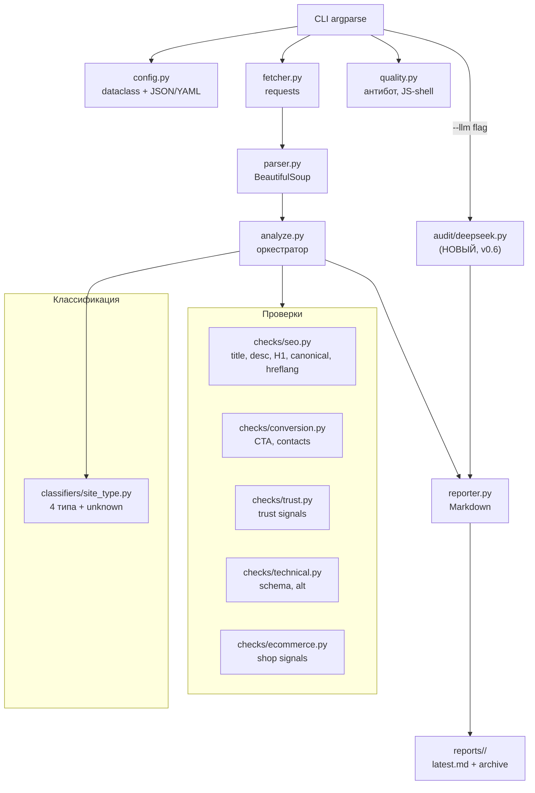

# Roadmap развития SiteAuditBot до версии 1.0

## Текущее состояние (v0.6 — "DeepSeek Integration")

- **Архитектура:** Модульный пакет `audit/` (17 модулей), монолит `audit.py` разбит.
- **Область аудита:** Главная страница (один HTTP-запрос).
- **Проверки:** SEO (title, description, H1, canonical, hreflang, robots.txt, sitemap.xml), технические (alt-атрибуты, schema.org, HTTP-заголовки), CTA, контакты, доверие (trust signals), ecommerce-чеклист (16 пунктов).
- **Классификация:** Эвристическая — 4 типа (ecommerce, services, corporate, saas) + unknown.
- **AI-анализ:** DeepSeek API через `openai` (опционально, флаг `--llm`).
- **Конфигурация:** Dataclass `AuditConfig` с возможностью загрузки из JSON/YAML.
- **Отчёты:** Markdown, сохраняются в `reports/<domain>/latest.md` + архив по дате.
- **Зависимости:** `requests`, `beautifulsoup4`, `openai>=1.0.0`.
- **Ограничения:** Нет обхода страниц, нет JS-рендеринга, нет тестов, нет CI/CD, нет JSON/HTML-формата отчёта.

---

## 1. Версионный план

### Версия 0.5 — "Технический базис" (РЕАЛИЗОВАНА)

**Цель:** Добавить технический SEO и улучшить структуру кода.

| Задача | Тип | Статус |
|--------|-----|--------|
| Проверка robots.txt и sitemap.xml | Быстрое | ✅ Реализовано |
| Проверка favicon | Быстрое | ✅ Реализовано |
| Проверка HTTP-заголовков (security) | Быстрое | ✅ Реализовано |
| Вынести константы в config | Быстрое | ✅ Реализовано |
| Модульная архитектура (разбить audit.py) | Среднее | ✅ Реализовано |
| Проверка alt-атрибутов изображений | Среднее | ✅ Реализовано |
| Проверка canonical, hreflang, schema.org | Среднее | ✅ Реализовано |
| Расширить CLI (--config) | Среднее | ✅ Реализовано |

Подробный план рефакторинга: [`plans/modular-architecture.md`](modular-architecture.md)  
Анализ и уточнения: [`plans/modular-architecture-review.md`](modular-architecture-review.md)

### Версия 0.6 — "DeepSeek Integration" (РЕАЛИЗОВАНА)

**Цель:** Добавить AI-анализ через DeepSeek как опциональный слой поверх существующего аудита.

**Commit:** `3627422`

**Реализованный функционал:**

- Новый модуль `audit/deepseek.py`:
  - `DeepSeekConfig` — dataclass (api_key, model, temperature, max_tokens)
  - `build_prompt()` — сборка структурированного промпта на русском языке
  - `generate_recommendations()` — вызов DeepSeek API через пакет `openai`, парсинг JSON
- CLI-флаг `--llm` — опциональное включение AI-анализа
- Секция "AI-анализ (DeepSeek)" в отчёте (только при `--llm`)
- Новая зависимость: `openai>=1.0.0`
- Перенос точки входа CLI из `audit/__init__.py` в `audit/__main__.py`

Принцип: без `--llm` v0.6 ведёт себя идентично v0.5.

Подробный план: [`plans/deepseek-integration-v0.6.md`](deepseek-integration-v0.6.md)

| Задача | Тип | Статус |
|--------|-----|--------|
| Модуль `audit/deepseek.py` (конфиг, промпт, API) | Среднее | ✅ Реализовано |
| Флаг `--llm` в CLI | Быстрое | ✅ Реализовано |
| AI-секция в отчёте | Быстрое | ✅ Реализовано |
| Зависимость `openai` | Быстрое | ✅ Реализовано |

**Результаты тестирования:**

1. `python -m audit https://books.toscrape.com` — отчёт без AI-секции, поведение идентично v0.5
2. `python -m audit https://books.toscrape.com --llm` (без `DEEPSEEK_API_KEY`) — предупреждение в stderr, аудит не падает, отчёт без AI-секции
3. `python -m audit https://books.toscrape.com --llm` (с рабочим `DEEPSEEK_API_KEY`) — AI-секция в отчёте с анализом и рекомендациями

### Версия 0.7 — "Глубокий аудит"

**Цель:** Многостраничный обход, скорость, тесты.

| Задача | Тип | Оценка |
|--------|-----|--------|
| Многостраничный аудит (краулер) | Крупное | 2-3 дня |
| Интеграция PageSpeed Insights API | Среднее | 4 ч |
| Юнит-тесты (pytest) | Среднее | 4 ч |
| Плагинная система проверок (архит.) | Архитектурное | 1 день |
| JSON-формат отчёта | Среднее | 3 ч |

**Итого:** ~4-5 рабочих дней.

### Версия 1.0 — "Профессиональный аудитор"

**Цель:** Полноценный инструмент для коммерческого аудита сайтов.

| Задача | Тип | Оценка |
|--------|-----|--------|
| Интеграция Playwright для JS-сайтов | Крупное | 2 дня |
| Асинхронный краулер (aiohttp/httpx) | Архитектурное | 1-2 дня |
| HTML-отчёт с визуализацией | Среднее | 4 ч |
| Скриншоты страниц (через Playwright) | Среднее | 3 ч |
| Сравнение аудитов (diff между датами) | Среднее | 4 ч |
| Документация (README, примеры, CLI help) | Среднее | 3 ч |
| CI/CD (GitHub Actions: тесты + линтер) | Среднее | 2 ч |

**Итого:** ~5-7 рабочих дней.

---

## 2. Крупные улучшения (перспективные)

### 2.1 Многостраничный аудит (обход сайта)

- **Польза:** Очень высокая — переход от "аудита главной" к полноценному аудиту сайта.
- **Сложность:** Высокая — нужен краулер с ограничением глубины, дедупликацией URL, обработкой пагинации.
- **Приоритет:** Высокий (v0.7).

Что даёт:
- Проверка структуры: битые ссылки, цепочки редиректов.
- Проверка типовых страниц: карточка товара, категория, контакты, блог.
- Сводная статистика по всему сайту.

Ограничения:
- Не более 50-100 страниц за один запуск.
- Только внутренние ссылки, same-domain.
- Игнорировать якоря, tel:, mailto:, javascript:.

### 2.2 JSON / HTML формат отчёта

- **Польза:** Высокая — интеграция с внешними системами, дашбордами, CI.
- **Сложность:** Средняя — добавить `--format json` и `--format html` (с шаблоном).
- **Приоритет:** Средний (v0.7).

JSON-схема (предварительно):

```json
{
  "version": "0.6",
  "url": "https://example.com",
  "timestamp": "2026-06-04T00:00:00Z",
  "summary": {
    "high": 4,
    "medium": 3,
    "low": 1,
    "trust_score": 3
  },
  "site_type": {
    "primary": "ecommerce",
    "primary_score": 40,
    "secondary": null
  },
  "checks": {
    "seo": [...],
    "conversion": [...],
    "trust": [...],
    "technical": [...],
    "ecommerce": [...]
  },
  "pages_crawled": 1
}
```

### 2.3 Юнит-тесты (pytest)

- **Польза:** Очень высокая — уверенность в рефакторинге, регрессия, документация через тесты.
- **Сложность:** Средняя — после разбиения на модули тесты пишутся легко.
- **Приоритет:** Высокий (v0.7).

Что покрыть:
- Классификация типа сайта (известные кейсы).
- Каждая проверка (title, description, H1, CTA, trust).
- Ecommerce-сигналы.
- Антибот-детекция.
- Формирование отчёта (snapshot-тесты).

### 2.4 Интеграция с Playwright для JS-сайтов

- **Польза:** Высокая — многие современные сайты — SPA (React, Vue), без JS пустой HTML.
- **Сложность:** Высокая — установка Playwright, управление браузером, таймауты, детекция JS-фреймворков.
- **Приоритет:** Средний (v1.0).

Что даёт:
- Аудит сайтов на Next.js, Nuxt, React SPA.
- Проверка видимого контента после рендеринга.
- Скриншот страницы (для отчёта).

---

## 3. Архитектурные изменения

### 3.1 Переход на плагинную систему проверок

- **Польза:** Очень высокая — возможность добавлять новые проверки без изменения ядра.
- **Сложность:** Высокая — нужен registry проверок, интерфейс `Check`, конвейер выполнения.
- **Приоритет:** Средний (v0.7, после модульной архитектуры).

Пример интерфейса:

```python
class CheckResult(BaseModel):
    severity: Literal["high", "medium", "low"]
    issue: str
    recommendation: str
    evidence: str | None = None
    category: str

class BaseCheck(ABC):
    @abstractmethod
    def run(self, context: AuditContext) -> list[CheckResult]: ...
```

### 3.2 Асинхронный краулер (aiohttp / httpx)

- **Польза:** Высокая — ускорение обхода в 5-10x за счёт конкурентных запросов.
- **Сложность:** Высокая — переход с `requests` на `httpx` или `aiohttp`, управление конкурентностью, лимиты.
- **Приоритет:** Средний (v1.0, после многостраничного аудита).

### 3.3 Хранение результатов в SQLite (опционально)

- **Польза:** Средняя — история аудитов, сравнение во времени, тренды.
- **Сложность:** Средняя — схема БД, миграции, API для запросов.
- **Приоритет:** Низкий (post-1.0).

---

## 4. Матрица приоритетов

| Улучшение | Польза | Сложность | Приоритет | Версия | Статус |
|-----------|--------|-----------|-----------|--------|--------|
| robots.txt + sitemap | Высокая | Низкая | Высокий | 0.5 | ✅ |
| Модульная архитектура | Высокая | Средняя | Высокий | 0.5 | ✅ |
| Alt-атрибуты | Высокая | Средняя | Высокий | 0.5 | ✅ |
| Canonical, hreflang, schema.org | Высокая | Средняя | Высокий | 0.5 | ✅ |
| HTTP-заголовки | Средняя | Низкая | Средний | 0.5 | ✅ |
| Favicon | Средняя | Низкая | Средний | 0.5 | ✅ |
| Конфиг вынести | Средняя | Низкая | Средний | 0.5 | ✅ |
| CLI (--config) | Средняя | Низкая | Средний | 0.5 | ✅ |
| DeepSeek AI-анализ | Высокая | Средняя | Высокий | 0.6 | ✅ |
| Многостраничный аудит | Очень высокая | Высокая | Высокий | 0.7 | ⬜ |
| PageSpeed API | Высокая | Средняя | Высокий | 0.7 | ⬜ |
| Юнит-тесты | Очень высокая | Средняя | Высокий | 0.7 | ⬜ |
| Плагинная система | Очень высокая | Высокая | Средний | 0.7 | ⬜ |
| JSON-отчёт | Высокая | Средняя | Средний | 0.7 | ⬜ |
| Playwright (JS) | Высокая | Высокая | Средний | 1.0 | ⬜ |
| Асинхронный краулер | Высокая | Высокая | Средний | 1.0 | ⬜ |
| HTML-отчёт | Средняя | Средняя | Низкий | 1.0 | ⬜ |
| Скриншоты | Средняя | Средняя | Низкий | 1.0 | ⬜ |
| Diff аудитов | Средняя | Средняя | Низкий | 1.0 | ⬜ |
| Документация | Высокая | Низкая | Высокий | 1.0 | ⬜ |
| CI/CD | Высокая | Средняя | Средний | 1.0 | ⬜ |

---

## 5. Диаграмма архитектуры (текущая v0.6 + целевая)



---

## 6. Риски и зависимости

| Риск | Влияние | Митигация |
|------|---------|-----------|
| Сайты с JS-рендерингом не дают контента | Аудит бесполезен для SPA | Playwright в v1.0; в v0.5-0.7 — детекция и предупреждение |
| Rate limiting / блокировка при краулинге | Неполный аудит | Задержки между запросами, уважение robots.txt, user-agent |
| PageSpeed API имеет квоты | Ошибка при массовых запусках | Кеширование результатов, fallback без API |
| Рост сложности кода | Трудность поддержки | Модульная архитектура + тесты обязательны до крупных изменений |
| Отсутствие API-ключа DeepSeek | AI-анализ недоступен | Проверка env var + конфиг; предупреждение и пропуск |
| DeepSeek API таймаут / ошибка | Сбой AI-секции | try/except, возврат None, аудит продолжается |
