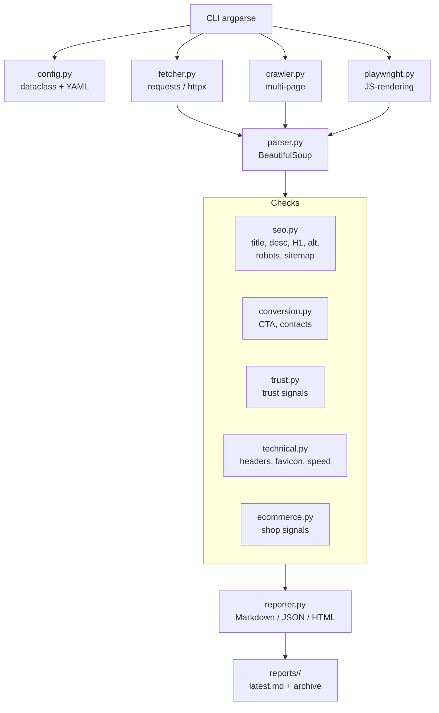

# Roadmap развития SiteAuditBot до версии 1.0

## Текущее состояние (v0.4)

- **Архитектура:** Один файл [`audit.py`](../audit.py) (~1815 строк) — монолит.
- **Область аудита:** Только главная страница (один HTTP-запрос).
- **Проверки:** SEO (title, description, H1), CTA, контакты, доверие (trust signals), ecommerce-чеклист (16 пунктов по главной).
- **Классификация:** Эвристическая — 4 типа (ecommerce, services, corporate, saas) + unknown.
- **Отчёты:** Markdown, сохраняются в `reports/<domain>/latest.md` + архив по дате.
- **Зависимости:** `requests`, `beautifulsoup4`.
- **Ограничения:** Нет обхода страниц, нет JS-рендеринга, нет технического аудита (скорость, alt, заголовки, robots, sitemap), нет CI/CD, нет тестов, нет конфигурации.

---

## 1. Быстрые улучшения (1-2 часа)

### 1.1 Добавить проверку robots.txt и sitemap.xml

- **Польза для качества аудита:** Высокая — базовый технический SEO без обхода сайта.
- **Сложность:** Низкая — два дополнительных HTTP-запроса, парсинг простых форматов.
- **Приоритет:** Высокий.

Что сделать:
- Проверить наличие `/robots.txt`, распарсить `Disallow`, `Sitemap`.
- Проверить доступность sitemap.xml (из robots.txt или стандартного пути).
- Вывести в отчёт: статус, количество запрещённых разделов, найденные sitemap.

### 1.2 Добавить проверку favicon

- **Польза:** Средняя — косвенный признак качества вёрстки и внимания к деталям.
- **Сложность:** Низкая — проверка `<link rel="icon">` в HTML и `/favicon.ico`.
- **Приоритет:** Средний.

### 1.3 Добавить проверку HTTP-заголовков (security + cache)

- **Польза:** Средняя — выявление проблем безопасности (отсутствие HSTS, X-Frame-Options).
- **Сложность:** Низкая — анализ `response.headers`.
- **Приоритет:** Средний.

Что проверять: `Strict-Transport-Security`, `X-Frame-Options`, `X-Content-Type-Options`, `Cache-Control`.

### 1.4 Вынести пороги и константы в отдельный конфиг

- **Польза:** Средняя — упрощает настройку без изменения кода.
- **Сложность:** Низкая — вынести `_MIN_HTML_CHARS`, `_MIN_VISIBLE_TEXT_CHARS`, `TIMEOUT`, `_CLASSIFY_MIN_PRIMARY_SCORE` и т.д. в YAML/JSON или dataclass.
- **Приоритет:** Средний.

---

## 2. Средние улучшения (полдня)

### 2.1 Модульная архитектура: разбить audit.py на пакет

- **Польза:** Высокая — основа для всех дальнейших улучшений, тестируемость, поддерживаемость.
- **Сложность:** Средняя — рефакторинг без изменения логики.
- **Приоритет:** Высокий.

Предлагаемая структура:

```
audit/
├── __init__.py          # Точка входа, CLI
├── config.py            # Конфигурация (dataclass + YAML/JSON)
├── fetcher.py           # HTTP-запросы, антибот-детекция
├── parser.py            # BeautifulSoup-парсинг (title, description, H1, ссылки)
├── classifiers/
│   ├── __init__.py
│   ├── site_type.py     # Классификация типа сайта
│   └── ecommerce.py     # Ecommerce-сигналы и проверки
├── checks/
│   ├── __init__.py
│   ├── seo.py           # Title, description, H1, robots, sitemap
│   ├── conversion.py    # CTA, контакты
│   ├── trust.py         # Trust signals
│   └── technical.py     # HTTP-заголовки, favicon, скорость
├── reporter.py          # Генерация Markdown-отчёта
└── models.py            # Pydantic-модели / dataclasses для данных
```

### 2.2 Добавить проверку alt-атрибутов у изображений

- **Польза:** Высокая — SEO (Google учитывает alt) и доступность (a11y).
- **Сложность:** Средняя — нужно собрать все ``, проверить наличие alt, пустые alt, дублирующиеся alt.
- **Приоритет:** Высокий.

Что проверять:
- % изображений без alt.
- Пустые alt (допустимо для декоративных, но нужно отметить).
- Дублирующиеся alt (признак шаблонной вёрстки).

### 2.3 Добавить проверку скорости загрузки (Lighthouse / PageSpeed Insights API)

- **Польза:** Высокая — скорость напрямую влияет на SEO и конверсию.
- **Сложность:** Средняя — интеграция с Google PageSpeed Insights API (бесплатный, ключ не обязателен для базовых запросов).
- **Приоритет:** Высокий.

Что выводить: Performance score, LCP, FID/INP, CLS, рекомендации.

### 2.4 Добавить поддержку аргументов командной строки (--output, --format, --config)

- **Польза:** Средняя — гибкость использования.
- **Сложность:** Низкая — расширить argparse.
- **Приоритет:** Средний.

Пример: `python -m audit https://example.com --format json --output report.json --config custom.yml`

---

## 3. Крупные улучшения (1-3 дня)

### 3.1 Многостраничный аудит (обход сайта)

- **Польза:** Очень высокая — переход от "аудита главной" к полноценному аудиту сайта.
- **Сложность:** Высокая — нужен краулер с ограничением глубины, дедупликацией URL, обработкой пагинации.
- **Приоритет:** Высокий.

Что даёт:
- Проверка структуры: битые ссылки, цепочки редиректов.
- Проверка типовых страниц: карточка товара, категория, контакты, блог.
- Сводная статистика по всему сайту.

Ограничения:
- Не более 50-100 страниц за один запуск.
- Только внутренние ссылки, same-domain.
- Игнорировать якоря, tel:, mailto:, javascript:.

### 3.2 JSON / HTML формат отчёта

- **Польза:** Высокая — интеграция с внешними системами, дашбордами, CI.
- **Сложность:** Средняя — добавить `--format json` и `--format html` (с шаблоном).
- **Приоритет:** Средний.

JSON-схема (предварительно):

```json
{
  "version": "0.5",
  "url": "https://example.com",
  "timestamp": "2026-05-29T20:00:00Z",
  "summary": {
    "high": 4,
    "medium": 3,
    "low": 1,
    "trust_score": 3
  },
  "site_type": {
    "primary": "ecommerce",
    "primary_score": 40,
    "secondary": null
  },
  "checks": {
    "seo": [...],
    "conversion": [...],
    "trust": [...],
    "technical": [...],
    "ecommerce": [...]
  },
  "pages_crawled": 1
}
```

### 3.3 Юнит-тесты (pytest)

- **Польза:** Очень высокая — уверенность в рефакторинге, регрессия, документация через тесты.
- **Сложность:** Средняя — после разбиения на модули тесты пишутся легко.
- **Приоритет:** Высокий.

Что покрыть:
- Классификация типа сайта (известные кейсы).
- Каждая проверка (title, description, H1, CTA, trust).
- Ecommerce-сигналы.
- Антибот-детекция.
- Формирование отчёта (snapshot-тесты).

### 3.4 Интеграция с Playwright для JS-сайтов

- **Польза:** Высокая — многие современные сайты — SPA (React, Vue), без JS пустой HTML.
- **Сложность:** Высокая — установка Playwright, управление браузером, таймауты, детекция JS-фреймворков.
- **Приоритет:** Средний (но важный для v1.0).

Что даёт:
- Аудит сайтов на Next.js, Nuxt, React SPA.
- Проверка видимого контента после рендеринга.
- Скриншот страницы (для отчёта).

---

## 4. Архитектурные изменения

### 4.1 Переход на плагинную систему проверок

- **Польза:** Очень высокая — возможность добавлять новые проверки без изменения ядра.
- **Сложность:** Высокая — нужен registry проверок, интерфейс `Check`, конвейер выполнения.
- **Приоритет:** Средний (после модульной архитектуры).

Пример интерфейса:

```python
class CheckResult(BaseModel):
    severity: Literal["high", "medium", "low"]
    issue: str
    recommendation: str
    evidence: str | None = None
    category: str

class BaseCheck(ABC):
    @abstractmethod
    def run(self, context: AuditContext) -> list[CheckResult]: ...
```

### 4.2 Асинхронный краулер (aiohttp / httpx)

- **Польза:** Высокая — ускорение обхода в 5-10x за счёт конкурентных запросов.
- **Сложность:** Высокая — переход с `requests` на `httpx` или `aiohttp`, управление конкурентностью, лимиты.
- **Приоритет:** Средний (после многостраничного аудита).

### 4.3 Хранение результатов в SQLite (опционально)

- **Польза:** Средняя — история аудитов, сравнение во времени, тренды.
- **Сложность:** Средняя — схема БД, миграции, API для запросов.
- **Приоритет:** Низкий (post-1.0).

---

## 5. Версионный план

### Версия 0.5 — "Технический базис"

**Цель:** Добавить технический SEO и улучшить структуру кода.

| Задача | Тип | Оценка |
|--------|-----|--------|
| Проверка robots.txt и sitemap.xml | Быстрое | 1 ч |
| Проверка favicon | Быстрое | 0.5 ч |
| Проверка HTTP-заголовков (security) | Быстрое | 0.5 ч |
| Вынести константы в config | Быстрое | 1 ч |
| Модульная архитектура (разбить audit.py) | Среднее | 4 ч |
| Проверка alt-атрибутов изображений | Среднее | 3 ч |
| JSON-формат отчёта | Среднее | 3 ч |
| Расширить CLI (--format, --output, --config) | Среднее | 1 ч |

**Итого:** ~14 часов (2 рабочих дня).

### Версия 0.7 — "Глубокий аудит"

**Цель:** Многостраничный обход, скорость, тесты.

| Задача | Тип | Оценка |
|--------|-----|--------|
| Многостраничный аудит (краулер) | Крупное | 2-3 дня |
| Интеграция PageSpeed Insights API | Среднее | 4 ч |
| Юнит-тесты (pytest) | Среднее | 4 ч |
| Плагинная система проверок (архит.) | Архитектурное | 1 день |

**Итого:** ~4-5 рабочих дней.

### Версия 1.0 — "Профессиональный аудитор"

**Цель:** Полноценный инструмент для коммерческого аудита сайтов.

| Задача | Тип | Оценка |
|--------|-----|--------|
| Интеграция Playwright для JS-сайтов | Крупное | 2 дня |
| Асинхронный краулер (aiohttp/httpx) | Архитектурное | 1-2 дня |
| HTML-отчёт с визуализацией | Среднее | 4 ч |
| Скриншоты страниц (через Playwright) | Среднее | 3 ч |
| Сравнение аудитов (diff между датами) | Среднее | 4 ч |
| Документация (README, примеры, CLI help) | Среднее | 3 ч |
| CI/CD (GitHub Actions: тесты + линтер) | Среднее | 2 ч |

**Итого:** ~5-7 рабочих дней.

---

## 6. Матрица приоритетов

| Улучшение | Польза | Сложность | Приоритет | Версия |
|-----------|--------|-----------|-----------|--------|
| robots.txt + sitemap | Высокая | Низкая | Высокий | 0.5 |
| Модульная архитектура | Высокая | Средняя | Высокий | 0.5 |
| Alt-атрибуты | Высокая | Средняя | Высокий | 0.5 |
| JSON-отчёт | Высокая | Средняя | Средний | 0.5 |
| HTTP-заголовки | Средняя | Низкая | Средний | 0.5 |
| Favicon | Средняя | Низкая | Средний | 0.5 |
| Конфиг вынести | Средняя | Низкая | Средний | 0.5 |
| CLI расширить | Средняя | Низкая | Средний | 0.5 |
| Многостраничный аудит | Очень высокая | Высокая | Высокий | 0.7 |
| PageSpeed API | Высокая | Средняя | Высокий | 0.7 |
| Юнит-тесты | Очень высокая | Средняя | Высокий | 0.7 |
| Плагинная система | Очень высокая | Высокая | Средний | 0.7 |
| Playwright (JS) | Высокая | Высокая | Средний | 1.0 |
| Асинхронный краулер | Высокая | Высокая | Средний | 1.0 |
| HTML-отчёт | Средняя | Средняя | Низкий | 1.0 |
| Скриншоты | Средняя | Средняя | Низкий | 1.0 |
| Diff аудитов | Средняя | Средняя | Низкий | 1.0 |
| Документация | Высокая | Низкая | Высокий | 1.0 |
| CI/CD | Высокая | Средняя | Средний | 1.0 |

---

## 7. Диаграмма архитектуры (целевая)



---

## 8. Риски и зависимости

| Риск | Влияние | Митигация |
|------|---------|-----------|
| Сайты с JS-рендерингом не дают контента | Аудит бесполезен для SPA | Playwright в v1.0; в v0.5-0.7 — детекция и предупреждение |
| Rate limiting / блокировка при краулинге | Неполный аудит | Задержки между запросами, уважение robots.txt, user-agent |
| PageSpeed API имеет квоты | Ошибка при массовых запусках | Кеширование результатов, fallback без API |
| Рост сложности кода | Трудность поддержки | Модульная архитектура + тесты обязательны до крупных изменений |
